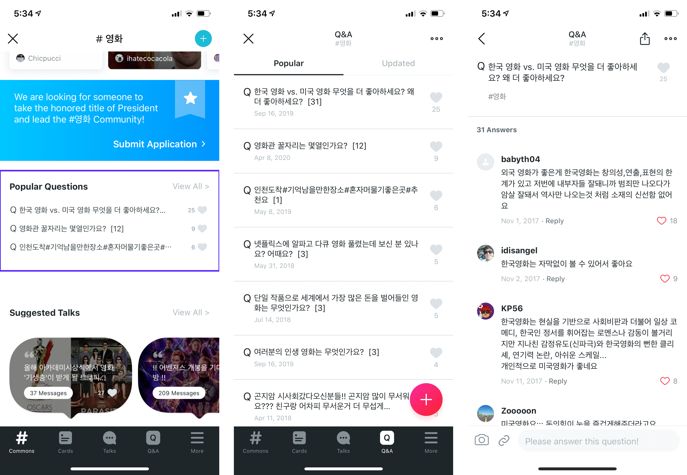
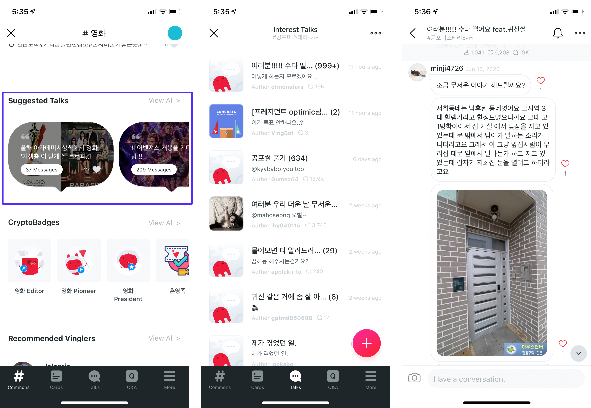
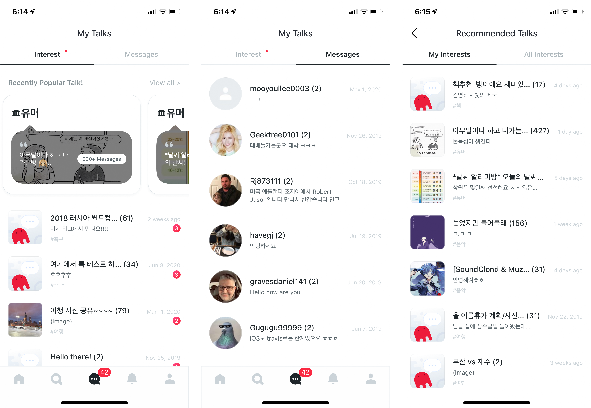
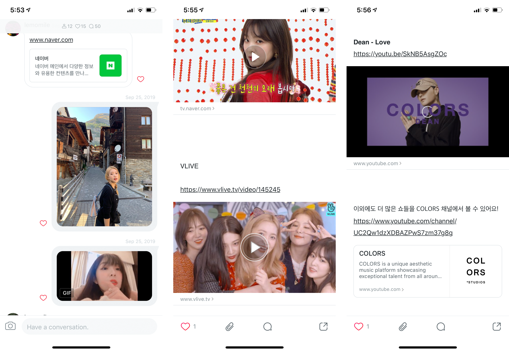
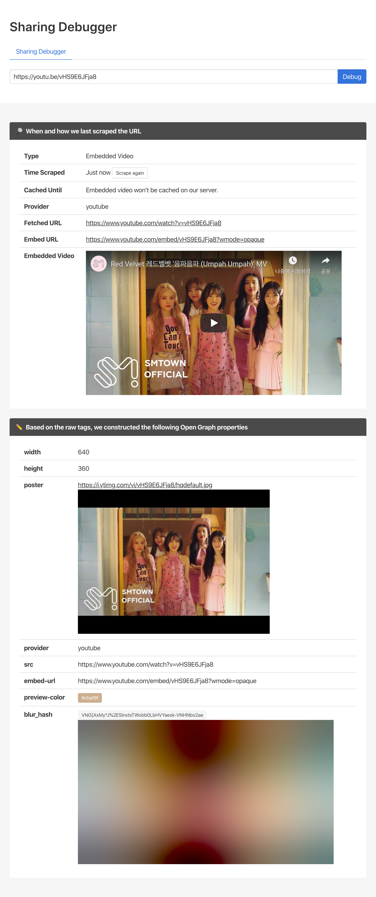
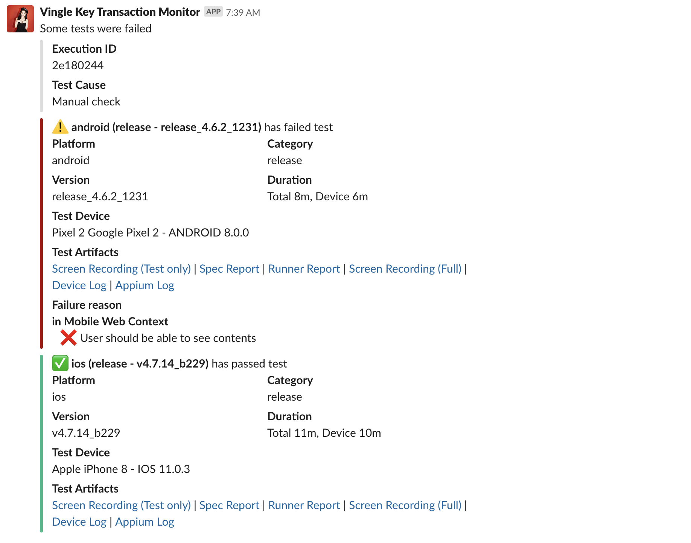
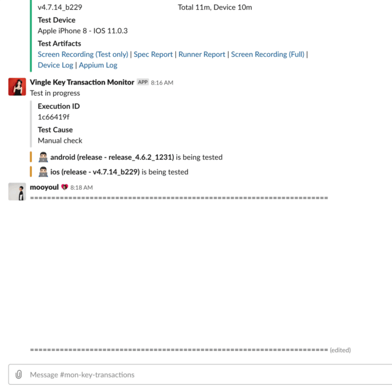
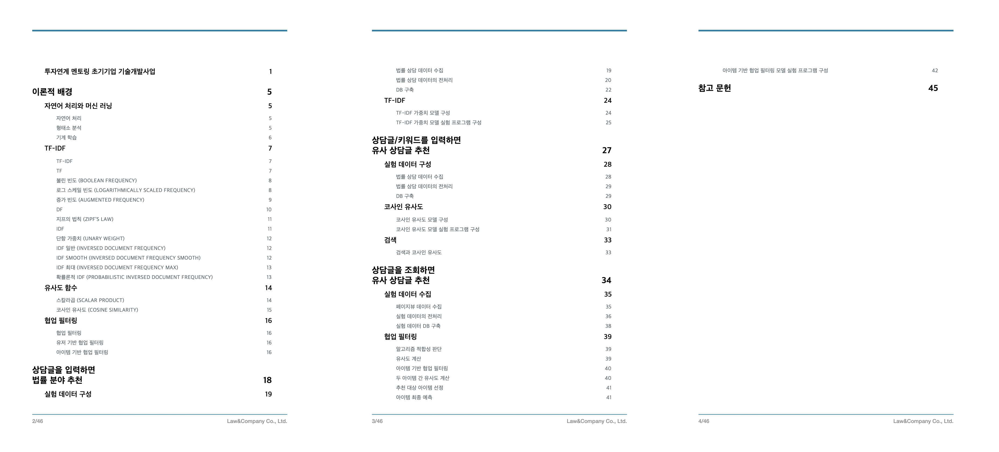
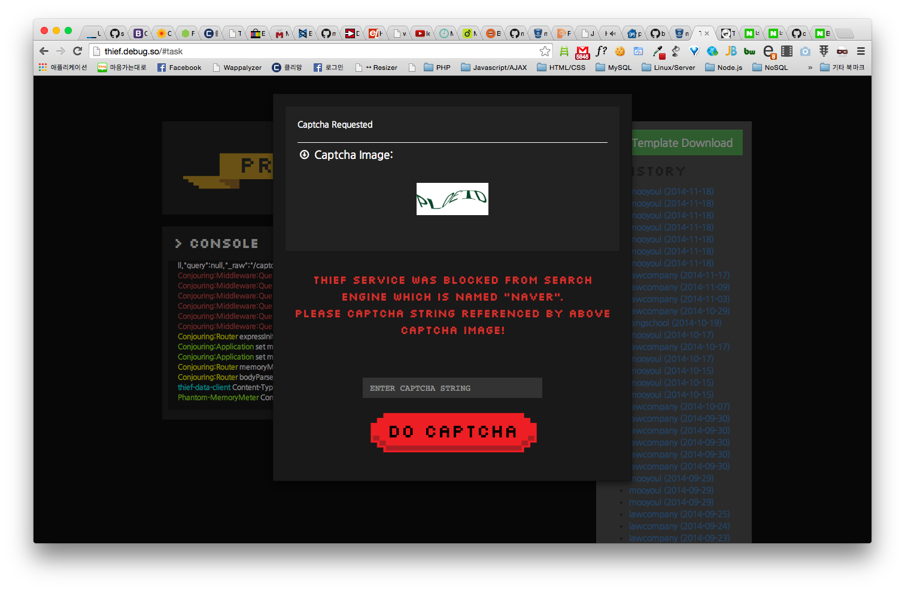

# MooYeol Prescott Lee

- Email: mooyoul@gmail.com
- LinkedIn: https://www.linkedin.com/in/mooyoul/
- SlideShare: https://www.slideshare.net/mooyoul
- Blog: https://mooyoul.github.io/

## About

안녕하세요. 소프트웨어 엔지니어 이무열입니다. 
다른 사람에게 내가 작성한 소프트웨어를 손쉽게 공유할 수 있는 웹의 매력에 푹 빠져 개발을 시작했다가, 
수능이 망해서 바로 취업 전선에 뛰어들었습니다. 아직도 웹을 정말 좋아하고, 배움이 항상 즐겁습니다.

백발 노인이 되는 날까지 개발을 즐겁게 하는 것이 제 커리어의 목표입니다.
개발자로서 커리어를 시작한 지 많은 시간이 흘렀지만, 아직도 배울것들이 많기에 
초심을 잃지 않고 지속적으로 학습하기 위해 여러 습관을 들이고 있습니다.

요즘에는 확장 가능한 시스템 디자인과 소프트웨어 아키텍쳐에 관심을 가지고 있습니다.

## Key Skills

- General Web-based Software Development
- Real-time Communication Software Development
- Media Software Development
    - Image Processing / Hosting (e.g. On-Demand (on-the-fly) resizing)
    - Animated Image Processing / Hosting
    - Video (VOD) Transcoding / Hosting / Streaming
    - Audio Transcoding / Hosting / Streaming (e.g. Audio only HLS stream)
    - Regional restrictions of Media Access

## Technical tastes

- Javascript, TypeScript, Node.js, Webstorm
- AWS, Serverless, Fully-managed service enthusiast
- *NIX, fish shell, tmux, lnav, bat, hexyl, Docker, 10+ active terminal sessions
- Chrome, 50+ active tabs
- Datagrip, Charles Proxy, Paw, VMWare ESXi
- Software Engineering Daily

## Work Experiences

### Vingle

*2017.03 ~ 2020.05 (3년 2개월) / Senior Software Engineer, Backend*

https://www.vingle.net/

시니어 소프트웨어 엔지니어로서, 백엔드 팀에서 서비스 설계부터 개발, 배포, 이후 개선까지 모든 단계를 담당했습니다.
신규 기능 개발뿐만 아니라, 기존 레거시 시스템에 대한 유지보수, 마이크로서비스로의 아키텍쳐 전환 지원, 
클라이언트 팀과의 협업, 그리고 운영 지원업무도 함께 수행했습니다.   

Details

#### 마이크로서비스 전환 지원

*2017. 03 ~ 2020.05*

기존 모놀리틱 애플리케이션을 마이크로서비스 아키텍쳐로 전환하는 과정에서 여러 지원업무를 수행했습니다.
기존 Ruby on Rails 애플리케이션을 분할해 여러 Node.js 기반 서비스로 전환했으며, 
아키텍쳐 변경에 따라 필요한 서비스 템플릿, CI/CD 파이프라인, 모니터링 시스템을 함께 변경했습니다. 

###### Related Techs
- Software: Node.js, TypeScript, Mocha, Sinon, Lolex, Nock, Ruby on Rails, RSpec
- Compute: AWS Lambda, Docker, AWS EC2, AWS ECS, AWS OpsWorks
- Storage: AWS DynamoDB, AWS RDS (Aurora, Postgres), AWS ElastiCache (Redis, Memcached), AWS S3, AWS SQS
- Networking: AWS VPC, AWS API Gateway, AWS CloudFront, OpenVPN
- CI/CD: Github Actions, Jenkins
- Monitoring: Sentry, NewRelic APM, NewRelic Synthetics, AWS CloudWatch, Grafana, InfluxDB, telegraf, Bosun, Slack API
 
#### 스팸 필터링 시스템 개발

*2017. 03*

스팸성 컨텐츠 노출을 줄일 수 있도록 스팸 필터를 개발하고, 발견-대응-완화 과정에 적극적으로 참여하였습니다.

컨텐츠에 링크가 첨부된 경우, HTTP Protocol 수준의 리디렉션 뿐만 아니라, 
Javascript Runtime을 통해 클라이언트에서 이루어지는 리디렉션을 감지할 수 있도록 개선하고,
도메인 변경을 통한 조건 우회를 방지하기 위해 DNS 수준의 필터, CIDR, IP 기반 필터를 추가해
다양한 스팸 시나리오에 대응할 수 있도록 하였습니다.

또한 주기적인 모니터링을 통해 사설 VPN을 통한 스팸 컨텐츠 포스팅, 다량 요청과 같은 부적절한 접근이 발견되는 경우
해당 VPN 업체의 IP 할당대역을 접근 차단하는 등 완화를 위해 적극적으로 노력했습니다.

###### Related Projects
- [suspicious-serverless](https://github.com/serverless-seoul/suspicious-serverless) - A collection of microservices for suspicious content inspection

###### Related Techs
- Software: Node.js, TypeScript, Mocha, Sinon, Nock
- Compute: AWS Lambda
- Storage: AWS DynamoDB 
- Networking: AWS CloudFront, AWS WAF, AWS API Gateway
- Others: Puppeteer, Headless Browser, Proxy/VPN detection, whois, DNS, dig, Slack API  

#### 온보딩 관심사 추천시스템 개발 

*2017. 04*

[Video Link](https://www.youtube.com/watch?v=QdCV3U2V_KE)

회원가입 후 온보딩 과정에서 팔로잉 할 관심사를 추천하는 시스템을 개발했습니다.

###### Related Techs
- Software: Node.js, TypeScript, Mocha, Sinon
- Compute: AWS Lambda
- Storage: AWS DynamoDB
- Networking: AWS API Gateway
- Others: Cosine similarity, Item-Item based collaborative filtering

#### 광고 시스템 개발

*2017.04*

5월 가정의 달에 집행할 광고를 노출할 수 있는 시스템 개발에 참여했습니다.

###### Related Techs
- Software: Node.js, TypeScript, Mocha, Angular 2
- Compute: AWS Lambda
- Storage: AWS RDS (Aurora MySQL), AWS S3
- Networking: AWS CloudFront, AWS API Gateway, AWS VPC

#### 유저 차단 시스템 개발

*2017.07*

특정 유저의 컨텐츠를 보지 않도록 숨기거나, 나를 볼 수 없도록 설정할 수 있는 유저 차단 시스템을 설계하고 개발했습니다.

###### Related Techs
- Software: Node.js, TypeScript, Mocha
- Compute: AWS Lambda
- Storage: AWS DynamoDB, AWS ElastiCache (Redis, Memcached)
- Networking: AWS API Gateway, AWS VPC

#### 컨텐츠 신고 시스템 개발

*2017.09*

컨텐츠를 신고하고 처리할 수 있는 신고 시스템을 개발했습니다.

###### Related Techs
- Software: Node.js, TypeScript, Mocha
- Compute: AWS Lambda
- Storage: AWS DynamoDB, AWS RDS (Aurora MySQL)
- Networking: AWS API Gateway, AWS VPC

#### Q&A 형식 컨텐츠 포맷 개발

*2017.10*

네이버 지식in, Quora와 같은 Q&A 형식의 컨텐츠 포맷을 설계하고 개발했습니다.

##### Feature Preview
- Question List: https://www.vingle.net/interests/%EC%98%81%ED%99%94/questions
- Question Show: https://www.vingle.net/questions/4ddd9ba6-79d9-4e39-9884-4b61d54a46d9
- Popular Questions: https://www.vingle.net/interests/%EC%98%81%ED%99%94/commons
 

##### Related Techs
- Software: Node.js, TypeScript, Mocha, Sinon
- Compute: AWS Lambda
- Storage: AWS DynamoDB, AWS ElastiCache (Redis, Memcached)
- Networking: AWS API Gateway

#### 사내 휴가 등록시스템 개발

*2017.11*

[Video Link](https://www.youtube.com/watch?v=PWtYW4uZ4ZE)

빙글에서 휴가를 사용하면 공용 구글 캘린더에 일정을 등록하고 본인의 휴가를 팀원에게 공유해야 하는데, 
외부 서비스에 휴가 일정을 등록하는 일이 번거로웠습니다. 이를 해결하기 위해 구성원들이 편리하게 휴가를 관리할 수 있는 웹 애플리케이션을 설계하고 개발했습니다.

##### Related Techs
- Software: Node.js, TypeScript, Mocha, Vue, Sass, Bulma, Webpack
- Compute: AWS Lambda
- Storage: AWS DynamoDB, AWS S3
- Networking: AWS CloudFront, AWS API Gateway
- Others: Google Calendar API, Slack API, CSV

#### 실시간 채팅 형식 컨텐츠 포맷 개발

*2018.01*

Message Persistence를 요구하는 실시간 채팅 기능을 설계하고 개발했습니다.

##### Feature Preview
- Talk List: https://www.vingle.net/interests/%EC%98%81%ED%99%94/talks
- Talk Show: https://www.vingle.net/interests/%EA%B3%B5%ED%8F%AC%EB%AF%B8%EC%8A%A4%ED%85%8C%EB%A6%AC/talks/t:7yru6nchfm
- Interest Recommended Talks: https://www.vingle.net/interests/%EA%B3%B5%ED%8F%AC%EB%AF%B8%EC%8A%A4%ED%85%8C%EB%A6%AC
- Interest Wall: https://www.vingle.net/interests/%EA%B3%B5%ED%8F%AC%EB%AF%B8%EC%8A%A4%ED%85%8C%EB%A6%AC/talks
 
##### Related Techs
- Software: Node.js, TypeScript, Mocha, Sinon
- Compute: AWS Lambda
- Storage: AWS DynamoDB, AWS ElastiCache (Clustered Redis)
- Networking: AWS IoT Core, AWS API Gateway

#### 미디어 컨텐츠 개발

*2018.02*

Image, Animated Image (GIF), Video, Link Preview (Open Graph), Embedded Video와 같은 다양한 미디어들을 여러 컨텐츠 포맷에서 사용 가능하도록 미디어 관련 기능들을 설계하고 개발했습니다.

Image Hosting의 경우 기존에 사용하던 SaaS인 Cloudinary에서 인하우스 On-demand Image Resizing 솔루션으로 전환하여 약 90%의 월간 비용 절감을 달성했으며, 
월 50TB 이상의 전송량 (약 1천만 요청/월) 이 발생하는 상황에서 Cloudinary에 업로드 된 약 2000만장 (~ 10TB)의 이전 이미지들 또한 서비스 중단 없이 성공적으로 마이그레이션 하였습니다.

Animated Image나 Video는 유머나 아이돌 관련 커뮤니티에서 사용자들이 많이 사용하는 미디어 타입이 되었습니다.
특히 Animated Image와 Video의 경우, 선택적으로 트랜스코딩을 지원하도록 구현하여 처리 프로세싱에 소요되는 시간이나 비용을 크게 단축할 수 있도록 하였습니다.

Video의 경우 HLS Output을 지원하여 클라이언트의 네트워크 상황에 따라 유연하게 품질을 선택할 수 있도록 지원했으며 (Adaptive Bitrate Streaming, 480p low, 720p medium, 1080p high), 
HLS를 지원하지 않는 상황을 고려해 단일 MP4 비디오 스트림을 함께 출력하도록 개발하였습니다.

미디어 출력이 예상된 결과가 맞는지 검증하기 위해 Unit Test 뿐만 아니라 Visual Regression Test / E2E Test까지 모두 작성했으며,
매 테스트에서 비디오 출력에 대한 PSNR, SSIM을 측정해 의도하지 않은 품질 하락이 발생하지 않도록 하였습니다.

##### Feature Preview
- Media General: https://www.vingle.net/posts/2674782
- Embedded Video: https://www.vingle.net/posts/2663507
- Link Preview & Embedded Video (mixed): https://www.vingle.net/posts/2683461

##### Related Talks
- [Vingle Tech Blog - GIF 사용을 멈춰주세요!](https://medium.com/vingle-tech-blog/stop-using-gif-as-animation-3c6d223fd35a)
- [AWSKRUG Serverless Meetup - Serverless Media Workflow](https://www.slideshare.net/mooyoul/serverless-media-workflow-95267586)
- [AWSKRUG Serverless Meetup - Lambdaless and AWS CDK](https://www.slideshare.net/mooyoul/lambdaless-and-aws-cdk-191793017)

##### Related Projects
- [webpinfo](https://github.com/mooyoul/node-webpinfo) - Strongly-typed WebP Container Parser for Node.js
- [bmp.js](https://github.com/mooyoul/bmp-js) - Forked bmp.js to support proper 1/2/4/8bit bitmap decoding
- [get-orientation](https://github.com/mooyoul/get-orientation) - Get orientation from EXIF of image file. Supports both Browser and Node.js
- [chai-image](https://github.com/mooyoul/chai-image) - Extends Chai with assertions about images
- [vuality](https://github.com/mooyoul/vuality) - Video Quality Assessment Utility for Node.js
- [is-webp-extended](https://github.com/mooyoul/is-webp-extended) - Extended version of is-webp package which supports Animated WebP                                                         

##### Related non-code contributions

- [WebKit Bugzilla - #203482 Orientation/rotation/EXIF is not preserved after image resizing](https://bugs.webkit.org/show_bug.cgi?id=203482) 
    - Related: [addyosmani/native-media-resizing #1 (comment)](https://github.com/addyosmani/native-media-resizing/issues/1#issuecomment-545980413)
- [lovell/sharp - #1890 GIF Regression?](https://github.com/lovell/sharp/issues/1890)
- [lovell/sharp - Answers](https://github.com/lovell/sharp/issues?q=commenter%3Amooyoul)
- [MediaArea/mediainfo - #1065 Incorrect GIF format detection if extension was omitted](https://github.com/MediaArea/MediaInfoLib/issues/1065)

##### Related Techs
- Software: Node.js, TypeScript, Mocha, Sinon, Nock
- Image Processing: libvips, sharp, oxipng, pngquant, tifig, Bitmap, JPEG/EXIF, libwebp, blurhash, node-vibrant, exiftool
- Animated Image Processing: gifsicle, libwebp, ffmpeg, ffprobe, x264, mediainfo
- Video Processing: ffmpeg, ffprobe, x264, AtomicParsley, mediainfo
- Compute: AWS Lambda, AWS Step Functions
- Storage: AWS DynamoDB, AWS S3
- Networking: AWS CloudFront, AWS API Gateway, Akamai
- Others: AWS Athena, Facebook Open Graph, Twitter Card, Youtube Data API, Twitch API, Naver TV, V LIVE, Proxy

#### Sitemap Service 개발

*2018.05*

Vingle 서비스의 Sitemap을 생성하는 서비스를 설계하고 개발했습니다.

##### Related Techs
- Software: Node.js, TypeScript, Mocha, Sinon, Nock
- Compute: AWS Lambda, AWS Step Functions
- Storage: AWS DynamoDB, AWS S3, AWS SQS
- Networking: AWS CloudFront, AWS API Gateway
- Others: AWS Athena, Sitemap, Google Search Console API

#### Mail Service 개발 

*2018.10*

Vingle 서비스 내에서 메일을 발송하기 위한 메일 서비스를 설계하고 개발했습니다. 

##### Related Techs
- Software: Node.js, TypeScript, Mocha, Sinon, Nock
- Compute: AWS Lambda, AWS Step Functions
- Storage: AWS S3
- Networking: AWS API Gateway
- Others: Sendgrid, Litmus, AWS Athena

#### Key Transaction Monitor 개발

*2019.08*

###### Screen recordings

**Slack**

**Test Sessions**

Android | iOS
------- | ---
 | 

빙글에서는 마케팅을 통해 유입된 유저들이 대부분 모바일 웹으로 랜딩하게 되고, 앱 설치를 유도했었습니다.
앱 설치 이후 모바일 웹에서 보던 컨텐츠를 앱 내에서 이어서 볼 수 있도록 Branch를 사용해 integration을 구성했었는데, 코드 변경으로 인해 이 기능이 올바르게 작동하지 않아 전환이 되지 않는 문제가 종종 발생했었습니다.

Branch 통합이 여러 플랫폼에 걸쳐있기 때문에, 전환되는 플로우를 매번 확인하기도 어려웠는데, 이를 자동으로 테스트하고 보고할 수 있는 시스템을 개발해서 사용했습니다.

##### Related Contributions
- [webdriverio/webdriverio - #4252 webdriver: truncate screen recording log](https://github.com/webdriverio/webdriverio/pull/4252)

##### Related Techs
- Software: Node.js, TypeScript, Appium, webdriver.io, Mocha
- Compute: AWS Lambda, AWS DeviceFarm
- Storage: AWS DynamoDB, AWS S3
- Others: Chrome DevTools Protocol, UIAutomator, XCUITest

#### 신규 서비스 개발

*2019.11 ~*

신규 서비스 설계 및 개발을 진행했습니다. 공개되지 않은 제품이기 때문에 상세 내용이 궁금하시다면 연락해주시기 바랍니다.

##### Related Features

- Realtime Messaging
    - Message Persistence
    - Typing Indicator
    - Presence Indicator
    - Emoji Reactions
- Image Proxy
- File Proxy, File Server

### Artists Card

*2016 ~ 2017 / Freelancer Software Engineer, Full Stack*

프리랜서 소프트웨어 엔지니어로 클래식 스트리밍 서비스인 클래식매니저의 MVP를 개발했습니다.

Details

#### 클래식매니저 개발

https://classicmanager.com/

클래식 음악 스트리밍 서비스인 클래식매니저의 MVP를 개발했습니다.

###### Related Techs

- Software (Backend): Node.js, Javascript, Prerender, Express, Bookshelf, Knex, Passport, Slack API
- Software (Frontend): Angular.js, Javascript, Sass, Bootstrap, Jade, Webpack
- Compute: AWS EC2, AWS Lambda
- Storage: AWS RDS (MySQL), AWS S3, AWS ElastiCache (Redis), AWS SQS
- Network: AWS CloudFront, AWS API Gateway
- Others: AWS Athena, Maxmind GeoIP Database

### Law&Company

*2014.11 ~ 2017.02 (2년 4개월) / Software Engineer, Full Stack*

주니어 소프트웨어 엔지니어로서, 법률 상담 서비스인 로톡 서비스와 집단 소송 서비스인 로스퀘어 서비스를 개발했습니다.   

Details

#### 로톡 서비스 개발

https://www.lawtalk.co.kr/

변호사 찾기, 온라인 상담, 전화 상담, 백오피스 개발에 참여해 백엔드 비즈니스 로직 작성, 여러 UI 디자인 개편, 신규 기능 추가와 같은 업무를 수행하였습니다.
주요 지표를 개선하기 위해 Google Spreadsheet 및 Slack을 통해 지표를 추적할 수 있도록 하였으며,
Sitemap 생성, 데이터 트레이닝과 같은 무거운 작업들을 단순 Cron Job에서 Job Queue를 사용하도록 개선하고, SEO 대응을 위한 Prerender 구성, 클라이언트 빌드 파이프라인 변경, Lazy Loading, Chunk Splitting 적용 등 다양한 시스템 개선 업무도 함께 수행했습니다.

###### Related Techs

- Software (Backend): Node.js, Iced CoffeeScript, Javascript (ES6), Kue, Prerender, Express, Socket.IO, Passport, Mandrill, KTH SMS, Programmable Voice, Payapp, Google Service APIs (Sheets, Drive, Analytics Core Reporting, Calendar, Drive), Slack API
- Analytics: Google Analytics, Heap, Facebook Pixel
- Compute: KT uCloudBiz, AWS EC2, AWS Lambda
- Storage: MongoDB, Redis, AWS RDS (MySQL), AWS S3
- Network: AWS CloudFront
- Monitoring (Backend): NewRelic APM, Capistrano, Shipit, PM2

- Software (Frontend): Angular.js, CoffeeScript, Javascript (ES6), Sass, Bootstrap, Jade, Naver Map
- Build (Frontend): Grunt, Gulp, Webpack
- Monitoring (Frontend): BugSnag, Errorception, TrackJS, NewRelic Browser
- Others (Frontend): Font Awesome, FontForge

###### Related Talks

- [AngularJS in Production](https://www.slideshare.net/mooyoul/angularjs-in-production-67292391) 라는 주제로 AngularJS 애플리케이션에 대한 빌드 파이프라인 변경, Lazy Loading, SEO 대응에 대해 발표했습니다.
- [Google API로 만드는 더 풍부한 백오피스](https://www.slideshare.net/mooyoul/gdg-incheon-devfest-2016-google-api) 라는 주제로 Google Spreadsheet, Google Drive, Google Analytics, Google Calendar, Slack API를 활용하는 방법에 대해 발표했습니다.

#### 서비스 성능 개선

풀스택 개발자로서 영역에 구애받지 않고 다양한 성능 이슈들을 해결하였습니다.
마케팅 이벤트 집행으로 갑작스럽게 유입 트래픽이 튀는 상황에도 정상적인 서비스가 가능하도록 미리 준비하고, 성능 이슈가 발생하는 부분은 APM의 도움을 받아 점진적으로 성능을 개선하였습니다.

- Zero downtime deployment
- MongoDB Query tuning
- Slow transaction optimization
- API Caching
- TTFB Optimization
- Static Resource CDN Caching
- Resource prefetching, Prioritizing Critical Section rendering
- Resource Compression, Minimize parallel resource requests
- Lazy Loading, Code Splitting, One-Time binding, Minimize two-way binding watchers

#### 법률정보 추천 시스템 개발

[Video Link](https://www.youtube.com/watch?v=KUwkzDKt0sQ)

기술개발사업 지원을 받아 법률정보 추천 시스템을 개발하고, 연구노트를 작성했습니다.
텍스트마이닝을 주제로 TF-IDF, 코사인 유사도, 협업 필터링 등 컨텐츠 추천을 위한 기술들을 학습하고 모델을 만들었고, 일부 모델의 경우 프로덕션 서비스에 적용하였습니다.

###### Related Techs
- Software (Backend): Node.js, Javascript, Kue
- Compute: AWS Lambda
- Storage: MongoDB, AWS S3
- Others: TF-IDF, Cosine similarity, Collaborative Filtering, Item-Item similarity matrix, User-User similarity matrix

#### 로앤컴퍼니 ARS 서비스 개발

[Video Link](https://www.youtube.com/watch?v=XtYT3Uh6i9w)

#### 로스퀘어 서비스 개발

집단소송 서비스인 로스퀘어 서비스를 개발했습니다.
안타깝게도, 규제로 인해 제품 출시가 이루어지지 못했습니다.

###### Related Techs
- Software (Backend): Node.js, Javascript, Express, Bookshelf, Knex, Mandrill, KTH SMS
- Software (Frontend): Marionette.js, Backbone.js, Javascript, RequireJS, Bootstrap
- Analytics: Google Analytics
- Compute: KT uCloudBiz
- Storage: MySQL

#### 로톡 MVP 개발

채팅으로 법률상담을 받을 수 있는 초기 MVP 개발에 참여하였습니다.

###### Related Techs
- Backend: Node.js, Javascript, Firebase Realtime Database, KT uCloudBiz, Cloud9, Mercurial, Bitbucket
- Frontend: Angular.js

### Freelancer Software Engineer

*2013.9 ~ 2014.11 (1년 3개월) / Software Engineer*

주니어 엔지니어로서, 더 많은 경험을 쌓고 성장하고 싶어 프리랜서로 여러 프로젝트를 수행했습니다.
외국어 과외 중개 서비스와 효율적인 광고 집행을 위한 크롤링 서비스를 개발하고, 평소 관심있었던 IoT 비즈니스와 임베디드 소프트웨어 개발에 대해 경험을 쌓고자 지원사업을 도움을 받아 수면등을 개발했습니다. 

Details

#### 스마트 수면등 개발

[Video Link](https://youtu.be/KOymNti7jvY)

디밍 가능한 Wi-Fi 기반 스마트 수면등 프로토타입을 개발해 코엑스에서 열린 박람회에 전시했습니다.

#### 효율적인 광고 집행을 위한 크롤링 서비스 개발

네이버 검색 키워드 광고의 효율적인 광고 입찰 및 집행을 위해, 각 키워드에 대해 충분한 입찰 가치가 있는지 판단할 수 있는 크롤링 서비스를 개발했습니다. 엑셀 시트를 통해 배치작업을 제출하면, 큐를 통해 PhantomJS 기반 크롤러를 동작하고, 결과를 취합해 엑셀 기반 리포트를 생성하는 서비스를 만들었습니다.

인증 이슈 및 복잡한 Ajax 호출로 인해 Headless Browser인 PhantomJS과 CasperJS를 사용해서 크롤링을 수행했으며, 불안정한 PhantomJS 실행환경에 대응하기 위해 별도의 watcher를 두어 불안정한 실행 환경에 대응할 수 있도록 하였습니다. 검색량 제한으로 인해 Captcha 입력이 필요한 경우에는 사용자에게 Captcha 이미지를 보여주고 Captcha 문자열을 입력받아 작업을 이어갈 수 있도록 구현하였습니다.

socket.io를 통해 터미널 콘솔 출력을 websocket으로 전달해 웹페이지 내 콘솔에서 실시간으로 agent의 상황을 확인할 수 있는 부가 기능도 함께 구현하였습니다.

###### Related Techs
- Application: Backbone.js, Customized Bootstrap, Font Awesome
- Agent: Node.js, Express, Socket.IO
- Worker: Node.js, PhantomJS, CapserJS, Back-ported packages for PhantomJS environment (express, debug)
- Others: NewRelic APM, VPN, KT uCloudBiz, Keymetrics PM2 agent/dashboard, Git, Bitbucket

#### 외국어 과외 예약 서비스 개발

온라인 웹사이트를 통해 온/오프라인 외국어 과외를 예약할 수 있는 서비스를 개발했습니다.
학생은 예약 가능한 강사의 커리큘럼, 스케쥴을 확인할 수 있고, 실시간 예약이 가능합니다. 이를 위해서 이니시스 PG 연동을 함께 진행했으며, 강사 관리, 스케쥴 관리, 예약 관리, 결제 관리 등 운영에 필요한 백오피스도 함께 개발했습니다. 

###### Related Techs
- Backend: PHP, MySQL, NGiNX, KT uCloudbiz, KTH SMS API, Toz API, INICIS Payment PG, NewRelic APM
- Frontend (Desktop): Backbone.js, RequireJS, Bootstrap, Font Awesome, NewRelic Browser
- Frontend (Mobile): SKTelecom Cornerstone
- Frontend (Back Office): Sencha ExtJS
- Others: Git, Bitbucket

### ENUSTECH

*2012.08 ~ 2013.11 (1년 4개월) / Software Engineer*

Details

#### 가로등/보안등 관제 시스템 유지보수

가로등/보안등 관제 시스템을 유지보수하는 업무를 담당했습니다.
각 지자체/관리업체별 다른 요구사항을 수정하거나, 현장의 관제 단말기와 서버간 연동 문제해결을 수행했습니다.

###### Related Techs
- Backend: PHP, MySQL
- Frontend: Vanilla Javascript, Google Maps, Daum Map

#### 블루투스 핸드셋 브랜드 웹사이트 개발

블루투스 핸드셋 브랜드 웹사이트를 개발했습니다.
브랜드 소개, 제품 소개, 공지사항, 제품 지원, 제품 문의와 같은 브랜드 웹사이트에서 필요한 기능들을 구현하였으며,
이벤트 진행을 위해 소셜 계정을 사용한 댓글 작성 기능을 직접 구현하고, 구 버전 브라우저 지원을 크로스 브라우징 이슈에 대응했습니다.
공지사항, 매뉴얼, 펌웨어 관리와 문의내역 확인 등 백오피스에서 필요한 기능들도 함께 구현했습니다.

###### Related Techs
- Backend: PHP, MySQL, OAuth 1.0a Consumer (Facebook, Twitter, Naver, Nate)
- Frontend: jQuery, Google Maps

#### 서버실 관리

사내 서버실을 운영/관리하는 업무를 담당했습니다. 

신규 서버가 입고되면 랙에 설치하고, OS를 포함해 필요한 소프트웨어를 설치하고 사용할 수 있도록 준비했으며.
디스크 손상이나 공조장치 고장으로 인해 장애가 발생한 경우 장에애 대응했습니다.
사내 Exchange Server 구성 변경과 같은 자잘한 업무 또한 수행했습니다.

###### Related Techs
- Software: Linux (CentOS, Ubuntu), Windows Server 2003, Exchange Server, Lync (Office Communicator), HP ILO

### DSN System

*2012.03 ~ 2012.06 (3개월) / Software Engineer*

기 개발된 유아동 의복 쇼핑몰에 새로운 기능을 추가하고, 유지보수 업무를 수행했습니다.

Details

###### Related Techs
- Backend: PHP, MySQL, NGiNX, INICIS Payment PG
- Frontend (Desktop): jQuery

## Talks

- [AWSKRUG Serverless Meetup - Lambdaless and AWS CDK](https://www.slideshare.net/mooyoul/lambdaless-and-aws-cdk-191793017)
- [AWSKRUG Serverless Meetup - Serverless Programmable Voice](https://www.slideshare.net/mooyoul/serverless-programmable-voice)
- [Vingle Tech Blog - GIF 사용을 멈춰주세요!](https://medium.com/vingle-tech-blog/stop-using-gif-as-animation-3c6d223fd35a)
- [AWSKRUG Serverless Meetup - Serverless Media Workflow](https://www.slideshare.net/mooyoul/serverless-media-workflow-95267586)
- [AWSKRUG Seminar Serverless 특집 - Apex를 사용한 Lambda function 관리 및 배포](assets/apex.pdf)
- [AngularJS in Production](https://www.slideshare.net/mooyoul/angularjs-in-production-67292391)
- [Google API로 만드는 더 풍부한 백오피스](https://www.slideshare.net/mooyoul/gdg-incheon-devfest-2016-google-api)

## Personal Projects

### Applications
 
- [poo.email](https://github.com/mooyoul/poo.email) - 💩✉️ poo.email is disposable email service like Mailinator, but built in Serverless way. 
- [refined-unipass](https://github.com/mooyoul/refined-unipass) - Yet another Web App that simplifies the Unipass (Korean Customs Service) and adds useful features
- [proxyfront](https://github.com/mooyoul/proxyfront) - Turn CloudFront as dynamic forward proxy server
- [lambdaless](https://github.com/mooyoul/lambdaless) - A collection of Lambdaless services
- [weird-audiobook](https://github.com/mooyoul/weird-audiobook) - Audiobook service of weirdmeetup blog
- [google-sites-slack-notification](https://github.com/mooyoul/google-sites-slack-notification) - Receive Slack notification when Google Sites has updated.
- [convert-it](https://github.com/mooyoul/convert-it) - Detect & Convert character encoding in Browser
- [serverless-prerender](https://github.com/mooyoul/serverless-prerender) - Serverless implementation of Prerender service
- [serverless-renovate-fargate](https://github.com/mooyoul/serverless-renovate-fargate) - A CloudFormation template for running self-hosted renovate service using Fargate
- [docker-untrunc](https://github.com/mooyoul/docker-untrunc) - Docker image for untrunc
- [kitulkitul](https://github.com/mooyoul/kitulkitul) - Web technology meets Kiturami IoT thermo controller (yes, it's just yet another kiturami app)
- [telegrambot-mailgram](https://github.com/mooyoul/telegrambot-mailgram) - Receive emails on Telegram, directly.
- [telegrambot-readerman](https://github.com/mooyoul/telegrambot-readerman) - RSS Feed Reader for Telegram using Telegram Bot API
- [telegrambot-navermap](https://github.com/mooyoul/telegrambot-navermap) - Naver Map Inline Bot for Telegram

### Libraries

- [geo-pattern](https://github.com/mooyoul/geo-pattern) - Create beautiful generative geometric background images from a string ✨ TypeScript port of jasonlong/geo_pattern. Supports both Node.js and Browser.
- [node-webpinfo](https://github.com/mooyoul/node-webpinfo) - Strongly-typed WebP Container Parser for Node.js
- [get-orientation](https://github.com/mooyoul/get-orientation) - Get orientation from EXIF of image file. Supports both Browser and Node.js
- [is-webp-extended](https://github.com/mooyoul/is-webp-extended) - Extended version of is-webp package which supports Animated WebP
- [chai-image](https://github.com/mooyoul/chai-image) - Extends Chai with assertions about images
- [vuality](https://github.com/mooyoul/vuality) - Video Quality Assessment Utility for Node.js
- [node-unipass](https://github.com/mooyoul/node-unipass) - Node.js API for accessing Unipass (Customs Clearance System of Korean Customs Service)
- [serverless-latest-layer-version](https://github.com/mooyoul/serverless-latest-layer-version) - A serverless plugin that replaces 'latest' version tag to actual lambda layer version
- [serverless-cloudfront-lambdaedge-plugin](https://github.com/mooyoul/serverless-cloudfront-lambdaedge-plugin) - A serverless plugin that injects actual Lambda Version ARN to LambdaAssociations in CloudFront CFN resource
- [aws-cdk-ses-domain-identity](https://github.com/mooyoul/aws-cdk-ses-domain-identity) - Constructs for provisioning and referencing domain identities which can be used in SES RuleSets and Actions Construct.
- [cloudwatch-logs-actions](https://github.com/mooyoul/cloudwatch-logs-actions) - Integrates Github Actions with AWS CloudWatch Logs
- [dynamodb-actions](https://github.com/mooyoul/dynamodb-actions) - Integrate Github Action with Amazon DynamoDB
- [tslint-actions](https://github.com/mooyoul/tslint-actions) - GitHub action that lints your code with TSLint (with Annotation support)
- [melon-ticket-actions](https://github.com/mooyoul/melon-ticket-actions) - Github Action that checks Ticket Availability in Melon Ticket and Sends Slack Notification if available  
- [node-standard](https://github.com/mooyoul/node-standard) - Personal JS standard packages monorepo
- [node-publishable](https://github.com/mooyoul/node-publishable) - Checks if a package is publishable to NPM registry
- [node-publishable-cli](https://github.com/mooyoul/node-publishable-cli) - Checks if a package is publishable to NPM registry
- [angulartics-facebook-pixel](https://github.com/mooyoul/angulartics-facebook-pixel) - Facebook Pixel plugin for Angulartics
- [angulartics-google-adwords-remarketing-tag](https://github.com/mooyoul/angulartics-google-adwords-remarketing-tag) - Google Adwords Remarketing Tag plugin for Angulartics
- [ui-state-loader](https://github.com/mooyoul/ui-state-loader) - Angular UI Router state definition loader
- [node-kiturami](https://github.com/mooyoul/node-kiturami) - Unofficial kiturami iot thermo controller API for Node.js
- [go-dash-button](https://github.com/mooyoul/go-dash-button) - Detect Amazon Dash Button Clicks for the Go programming language
- [open-webstorm](https://github.com/mooyoul/open-webstorm) - Open Jetbrains Webstorm workspace from Node.js

## Contributions

[Mozilla Developers Network Profile](https://wiki.developer.mozilla.org/en-US/profiles/mooyoul)

##### Github Contributions

- [balmbees/corgi](https://github.com/balmbees/corgi/commits?author=mooyoul)
- [balmbees/dynamo-types](https://github.com/balmbees/dynamo-types/commits?author=mooyoul)
- [balmbees/serverless-tag-plugin](https://github.com/serverless-seoul/serverless-tag-plugin/commits?author=mooyoul)
- [balmbees/memcached-typed](https://github.com/serverless-seoul/memcached-typed/commits?author=mooyoul)
- [serverless-seoul/suspicious-serverless](https://github.com/serverless-seoul/suspicious-serverless/commits?author=mooyoul)
- [dynamoose/dynamoose](https://github.com/dynamoose/dynamoose/commits?author=mooyoul)
- [apex/apex](https://github.com/apex/apex/commits?author=mooyoul)
- [naver/passport-naver #5](https://github.com/naver/passport-naver/pull/5)
- [hashicorp/terraform #10950](https://github.com/hashicorp/terraform/pull/10950) [hashicorp/consul #2620](https://github.com/hashicorp/consul/pull/2620)
- [visonmedia/debug #166](https://github.com/visionmedia/debug/pull/166)
- [sindresorhus/file-type #331](https://github.com/sindresorhus/file-type/pull/331)
- [webdriverio/webdriverio #4252](https://github.com/webdriverio/webdriverio/pull/4252)
- [lightsofapollo/joi-to-json-schema #28](https://github.com/lightsofapollo/joi-to-json-schema/pull/28)
- [ACloudGuru/serverless-plugin-aws-alerts #13](https://github.com/ACloudGuru/serverless-plugin-aws-alerts/pull/13)
- [nock/nock #528](https://github.com/nock/nock/pull/528) [timkelty/shipit-shared #40](https://github.com/timkelty/shipit-shared/pull/40) [angular-ui/ui-sortable #454](https://github.com/angular-ui/ui-sortable/pull/454) [marionettejs/backbone.marionette #2978](https://github.com/marionettejs/backbone.marionette/pull/2978) [ChromeDevTools/awesome-chrome-devtools #20](https://github.com/ChromeDevTools/awesome-chrome-devtools/pull/20) [angulartics/angulartics #403](https://github.com/angulartics/angulartics/pull/403) [summernote/summernote #681](https://github.com/summernote/summernote/pull/681)
- [sindresorhus/on-change #1](https://github.com/sindresorhus/on-change/pull/1) [sindresorhus/clean-stack #16](https://github.com/sindresorhus/clean-stack/pull/16) [sindresorhus/is-webp #3](https://github.com/sindresorhus/is-webp/pull/3) [sdras/awesome-actions #191](https://github.com/sdras/awesome-actions/pull/191) [crazy-max/ddns-route53 #154](https://github.com/crazy-max/ddns-route53/pull/154) [jasonlong/geo_pattern #69](https://github.com/jasonlong/geo_pattern/pull/69)
- [mcollina/node-whatwg-streams-proposal #1](https://github.com/mcollina/node-whatwg-streams-proposal/pull/1) [daviddias/awesome-hacking-locations #155](https://github.com/daviddias/awesome-hacking-locations/pull/155)

#### Financial Contributions

Open Collective: https://opencollective.com/mooyoullee

크지 않은 금액이지만, 2016년부터 후원을 통해 금전적인 기여를 꾸준히 하고 있습니다.
현재까지 $500을 조금 넘는 금액을 후원했습니다. 도움을 많이 받은 프로젝트들인 Apex, cheerio, debug, sinon, 
그리고 Node.js 생태계에서 정말 많은 기여룰 해준 Sindre Sorhus에 후원하고 있으며, 계속 후원을 늘여가려고 합니다.

## Security Researches 

[HackerOne Profile](https://hackerone.com/mooyoul)

- Slack: Improper Access Control - Generic (CWE-284), $100 bounty received, undisclosed
- Slack: Cleartext Transmission of Sensitive Information (CWE-319), $500 bounty received, undisclosed
- OO건설: 부적절한 접근 제어 정책, 외부망에서의 비인가 접근 및 세대 홈 오토메이션 (전등 및 가스) 제어 권한 탈취, KISA, 비공개

## Awards

- 경상남도 정보올림피아드 경시부문 동상, 2010
